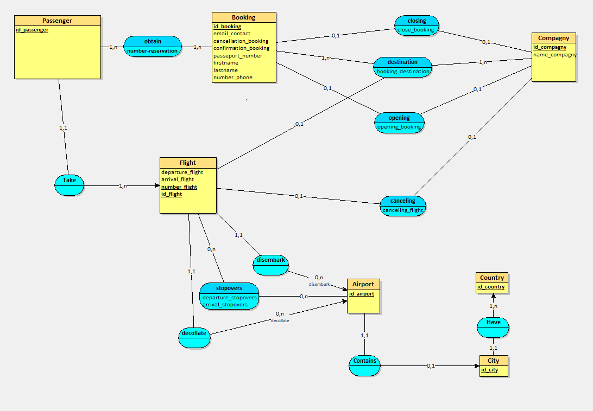
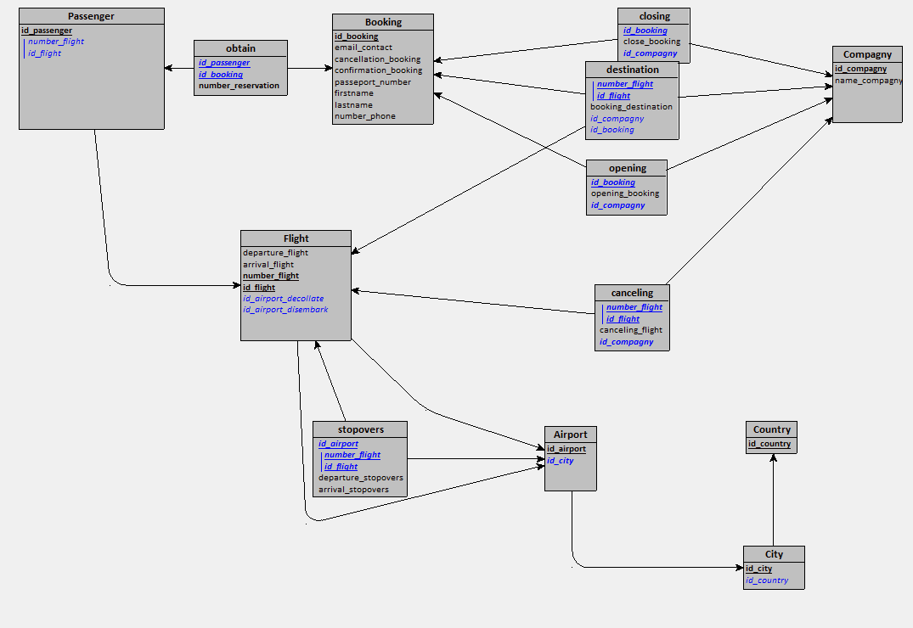
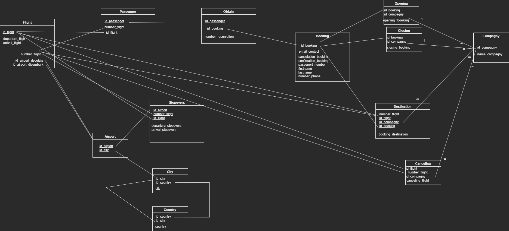
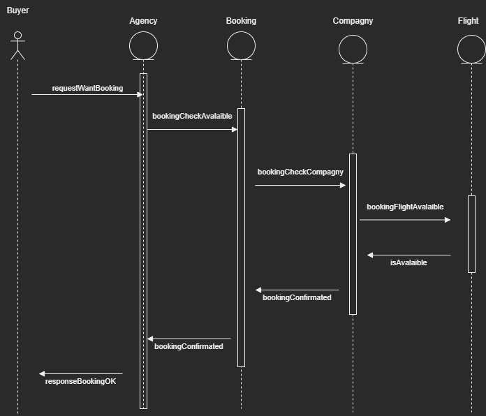
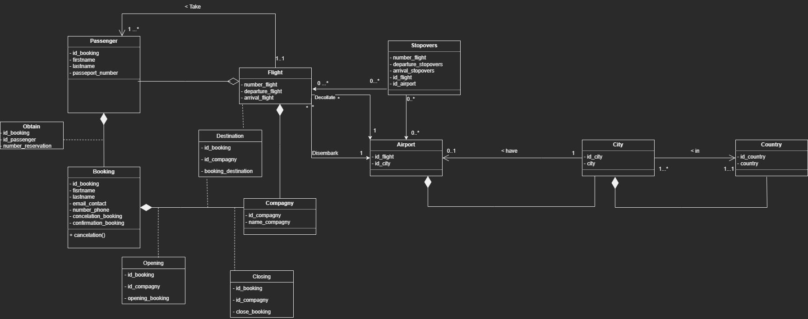
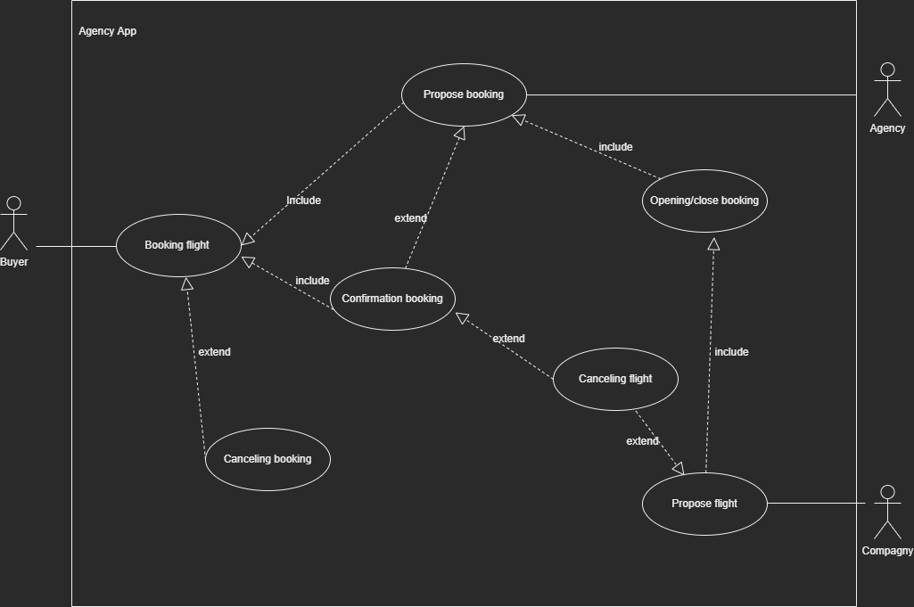

# Keke voyages ( MERISE, MCD, MLD, MPD, UML)

---

#### Contexte du projet

Votre client, une agence de voyages, souhaite proposer la possibilité de réserver en ligne des billets d'avion à leurs clients.

Votre mission est de concevoir à l'aide du standard UML la modélisation de la plateforme.

La plateforme devra permettre que :

- Un vol est ouvert à la réservation et refermé sur ordre de la compagnie.
- Un vol peut être annulé par la compagnie
- Un client peut réserver un ou plusieurs vols, pour des passagers différents.
- Une réservation concerne un seul vol et un seul passager.
- Une réservation peut être annulée ou confirmée.
- Un vol a un aéroport de départ et un aéroport d’arrivée.
- Un vol a un jour et une heure de départ, et un jour et une heure d’arrivée.
- Un vol peut comporter des escales dans des aéroports.
- Une escale a une heure d’arrivée et une heure de départ.
 Chaque aéroport dessert une ou plusieurs villes.
- Des compagnies aériennes proposent différents vols.
​
#### Modalités pédagogiques

Travail en individuel. Livraison pour Mardi 20 Septembre 2022 09h00.


#### Critères de performance

- Un readme répertoriant les informations principales.
- Tous les diagrammes doivent correspondre à la notation officielle du standard UML et Merise
- Les diagrammes doivent être exportés en format images facilement consultables (jpeg, png).
- Minimum d'un commit par diagramme.
- La conception Merise doit respecter au minimum les 3 premières formes normales.

#### Modalités d'évaluation
Correction en groupe et revue des diagrammes sur Github
#### Livrables

Dans un dépôt Github : 
Pour la base de données :
- Un MCD
- Un MLD
- Un MPD

Pour l'application :
- Un dictionnaire de données
- Des règles de gestion
- Un diagramme de cas d'utilisation
- Un diagramme de classe
- Un diagramme de Séquence

---

## Règles métier : 


RESERVATION  

- un email de contact

- un numéro de téléphone

- nom

- prénom

- un n° de passport

- peut être annuler par le CLIENT  

- une réservation ne peu être que pour une seul personne et un seul vol

- numéro de réservation

- peut être confirmé par l'agence


VOL  

- le vol contient un numéro de vol  

- aéroport de départ, une date, une heure  

- aéroport d'arrivé, une date, une heure  

- vol avec un ou plusieur passager  

- un vol ne peux pas être reservable ou non  

- un vol peut faire des escale dans un AEROPORT  

- le vol est un trajet d'un aeroport à un autre  

- un vol peut être annulé par la compagnie

- numéro de vol

COMPAGNIE

- contiens un nom

- peut avoir un ou plusieurs vol

ESCALE

- une date et une heure d'arrivé  

- une date et une heure de départ  

- un aeroport d'arrivé  

- un aeroport de départ

 

AEROPORT

- se trouve dans une ville  


VILLE

- un nom
- se trouve dans une pays

--------------------------------------------

## Dictionaire des données :

| Name                  | Type  | Description                               |
| --------------------- | :---: | :---------------------------------------- |
| name\_compagny        |  AN   | name of the compagny                      |
| number\_flight        |   N   | number id of flight                       |
| number\_reservation   |   N   | number id of reservation                  |
| opening\_booking      |   B   | compagny open the reservation             |
| closing\_vol          |   B   | compagny close the reservation            |
| canceling\_booking    |   B   | buyer canceling reservation               |
| airport               |   C   | id airport of city                        |
| departure\_flight     | Date  |                                           |
| arival\_flight        | Date  |                                           |
| city                  |  AN   | city of airport                           |
| country               |   A   |                                           |
| confirmation\_booking |   B   |                                           |
| departure\_stopovers_ | Date  |                                           |
| arrival\_stopovers    | Date  |                                           |
| email\_contact        |  AN   | email of buyer                            |
| lastname              |   A   | lastname of passenger                     |
| firstname             |   A   | firstname of passenger                    |
| passeport\_number     |   N   | passport of passenger use for reservation |
| booking\_destination  |  AN   | destination of travel                         |
| number\_phone | AN | number phone of buyer |


----------------

## MCD



## MLD



## MPD 



### SQL
```SQL 
CREATE TABLE Compagny(
   id_compagny COUNTER,
   name_compagny VARCHAR(50),
   PRIMARY KEY(id_compagny)
);

CREATE TABLE Booking(
   id_booking COUNTER,
   email_contact VARCHAR(50),
   cancellation_booking LOGICAL,
   confirmation_booking LOGICAL,
   passeport_number INT,
   firstname VARCHAR(50),
   lastname VARCHAR(50),
   number_phone INT,
   PRIMARY KEY(id_booking)
);

CREATE TABLE Country(
   id_country COUNTER,
   PRIMARY KEY(id_country)
);

CREATE TABLE City(
   id_city COUNTER,
   id_country INT NOT NULL,
   PRIMARY KEY(id_city),
   FOREIGN KEY(id_country) REFERENCES Country(id_country)
);

CREATE TABLE Airport(
   id_airport COUNTER,
   id_city INT NOT NULL,
   PRIMARY KEY(id_airport),
   UNIQUE(id_city),
   FOREIGN KEY(id_city) REFERENCES City(id_city)
);

CREATE TABLE Flight(
   number_flight INT,
   id_flight COUNTER,
   departure_flight DATETIME,
   arrival_flight DATETIME,
   id_airport_decollate INT NOT NULL,
   id_airport_disembark INT NOT NULL,
   PRIMARY KEY(number_flight, id_flight),
   FOREIGN KEY(id_airport_decollate) REFERENCES Airport(id_airport),
   FOREIGN KEY(id_airport_disembark) REFERENCES Airport(id_airport)
);

CREATE TABLE Passenger(
   id_passenger COUNTER,
   number_flight INT NOT NULL,
   id_flight INT NOT NULL,
   PRIMARY KEY(id_passenger),
   FOREIGN KEY(number_flight, id_flight) REFERENCES Flight(number_flight, id_flight)
);

CREATE TABLE stopovers(
   id_airport INT,
   number_flight INT,
   id_flight INT,
   departure_stopovers DATETIME,
   arrival_stopovers DATETIME,
   PRIMARY KEY(id_airport, number_flight, id_flight),
   FOREIGN KEY(id_airport) REFERENCES Airport(id_airport),
   FOREIGN KEY(number_flight, id_flight) REFERENCES Flight(number_flight, id_flight)
);

CREATE TABLE obtain(
   id_passenger INT,
   id_booking INT,
   number_reservation INT,
   PRIMARY KEY(id_passenger, id_booking),
   UNIQUE(number_reservation),
   FOREIGN KEY(id_passenger) REFERENCES Passenger(id_passenger),
   FOREIGN KEY(id_booking) REFERENCES Booking(id_booking)
);

CREATE TABLE opening(
   id_booking INT,
   opening_booking LOGICAL,
   id_compagny INT NOT NULL,
   PRIMARY KEY(id_booking),
   UNIQUE(id_compagny),
   FOREIGN KEY(id_booking) REFERENCES Booking(id_booking),
   FOREIGN KEY(id_compagny) REFERENCES Compagny(id_compagny)
);

CREATE TABLE closing(
   id_booking INT,
   close_booking LOGICAL,
   id_compagny INT NOT NULL,
   PRIMARY KEY(id_booking),
   UNIQUE(id_compagny),
   FOREIGN KEY(id_booking) REFERENCES Booking(id_booking),
   FOREIGN KEY(id_compagny) REFERENCES Compagny(id_compagny)
);

CREATE TABLE canceling(
   number_flight INT,
   id_flight INT,
   canceling_flight LOGICAL,
   id_compagny INT NOT NULL,
   PRIMARY KEY(number_flight, id_flight),
   UNIQUE(id_compagny),
   FOREIGN KEY(number_flight, id_flight) REFERENCES Flight(number_flight, id_flight),
   FOREIGN KEY(id_compagny) REFERENCES Compagny(id_compagny)
);

CREATE TABLE destination(
   number_flight INT,
   id_flight INT,
   booking_destination VARCHAR(50),
   id_compagny INT NOT NULL,
   id_booking INT NOT NULL,
   PRIMARY KEY(number_flight, id_flight),
   FOREIGN KEY(number_flight, id_flight) REFERENCES Flight(number_flight, id_flight),
   FOREIGN KEY(id_compagny) REFERENCES Compagny(id_compagny),
   FOREIGN KEY(id_booking) REFERENCES Booking(id_booking)
);

```

## UML SEQUENCE 



## UML CLASSE



## UML USER CASE


